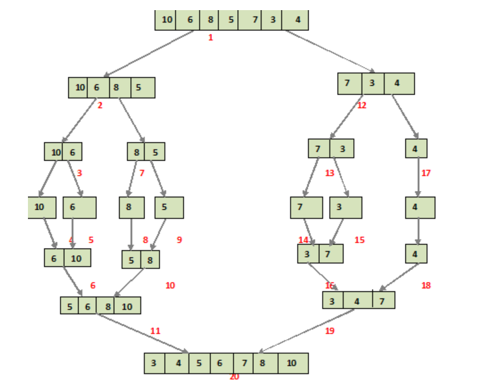

## Description

Merge sort is a sorting algorithm that works by dividing an array into smaller subarrays, sorting each subarray, and then merging the sorted subarrays back together to form the final sorted array.

**Steps**

* At first, check if the left index of array is less than the right index, if yes then calculate its mid point

* Now, as we already know that merge sort first divides the whole array iteratively into equal halves, unless the atomic values are achieved.

* Here, we see that an array of 7 items is divided into two arrays of size 4 and 3 respectively.

* Now, again find that is left index is less than the right index for both arrays, if found yes, then again calculate mid points for both the arrays.

* Now, further divide these two arrays into further halves, until the atomic units of the array is reached and further division is not possible.

* After dividing the array into smallest units, start merging the elements again based on comparison of size of elements

* Firstly, compare the element for each list and then combine them into another list in a sorted manner.

